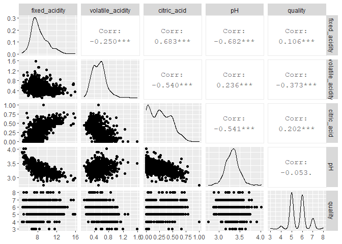
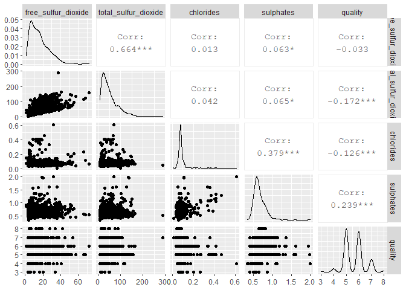
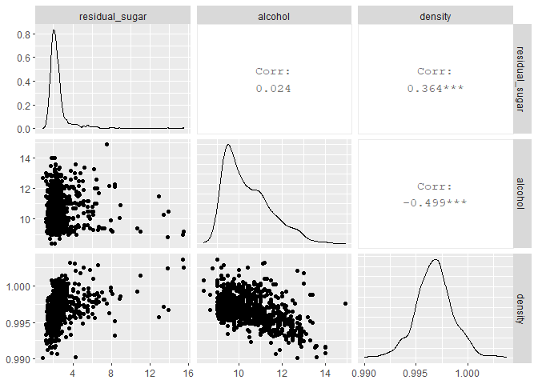

Splitting-and-Basic-Plots
================
Grant Swigart
7/7/2020

I import the red wine dataset, keep %80 of the data for training and
then output the datasets into the test/train folder.

``` r
library(tidyverse)
library(caret)
library(GGally)
red<-read_delim("./Wine Data-Original/winequality-red.csv",delim = ';')
# removing spaces form names
names(red)<-str_replace_all(names(red),' ','_')
```

``` r
set.seed(30)
trainIndex <- createDataPartition(red$quality,
                                  p = .8, 
                                  list = FALSE)
red_train<-red[c(trainIndex),]
red_test<-red[-c(trainIndex),]

write_csv(red_train,"./Test and Training Data/training.csv")
write_csv(red_test,"./Test and Training Data/testing.csv")
```

Here are a few quick plots\!

``` r
red_train %>% 
  select(c("fixed_acidity","volatile_acidity","citric_acid","pH","quality")) %>%
  ggpairs()
```

<!-- -->

``` r
red_train %>% 
  select(c("free_sulfur_dioxide","total_sulfur_dioxide","chlorides","sulphates","quality")) %>%
  ggpairs()
```

<!-- -->

``` r
red_train %>% 
  select(c("residual_sugar","alcohol","density")) %>%
  ggpairs()
```

<!-- -->
